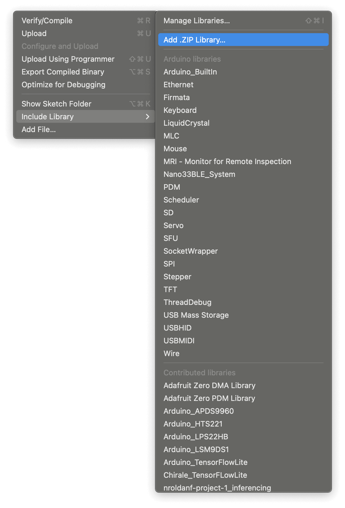
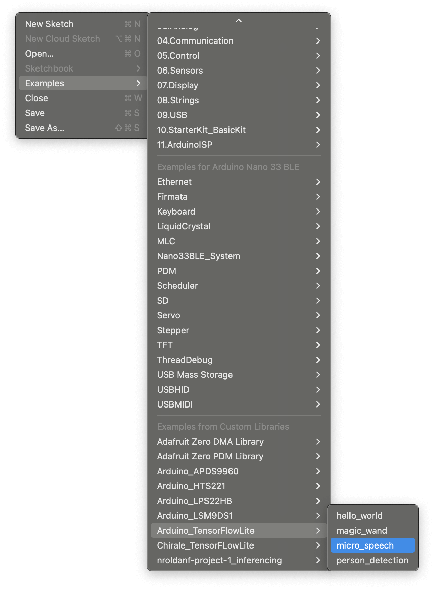
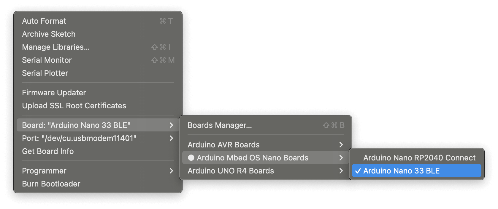
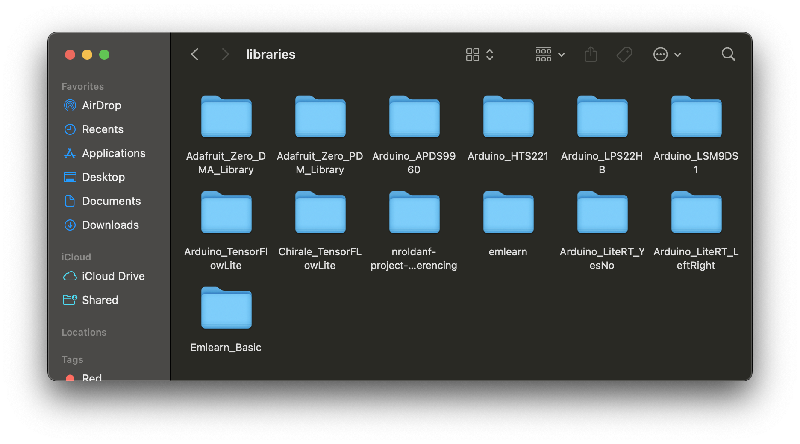
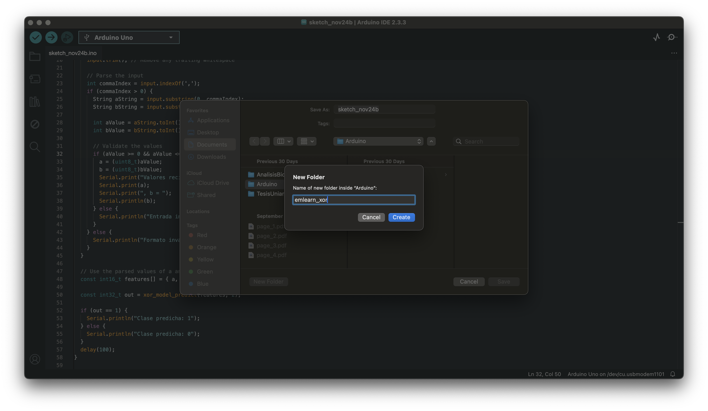

# Machine Learning en Sistemas Embebidos

En este repositorio se puede encontrar el código fuente correspondiente a los demos de "Wake word detection con Tensorflow + LiteRT" y "Predicción de XOR con scikilearn + emlearn" presentados cómo proyecto final para la materia "Machine Learning for Engineering (IBIO-4711)" impartida por el profesor Luis Felipe Giraldo Trujillo en la Universidad de Los Andes - Colombia.

Integrantes:
- Meliza Benjumea
- Camilo Lara
- Nicolás Roldán

## Detección de palabra clave - Tensorflow

>Nota: Se recomienda correr el siguiente notebook dentro de Google Colab.

### Entrenar un nuevo modelo - Scikit Learn

Dos modelos diferentes ya fueron previamente entrenados:
- [lite_rt_left_right](lite_rt_left_right): Reconoce las palabras "left" and "right", además de "unknown" y "silence".
- [lite_rt_yes_no](lite_rt_yes_no): Reconocer las palabras "yes" and "no, además de "unknown" y "silence".

Los pesos, grafo y archivo FlatBuffer (.tflite) pueden encontrarse [aquí](weights/left_right/) para el primer modelo, y [aquí](weights/yes_no/) para el segundo.

En caso de querer entrenar un nuevo modelo para las palabras disponibles en el dataset usado, corra el notebook `ProyectoFinalGrupo7.ipnb` en Google Colab. Para ello, habilite el runtime de GPU. Con esto, el modelo debería terminar en menos de 2 horas aproximadamente.

### ¿Cómo desplegar un nuevo modelo?

Para usar el nuevo modelo que va a ser desplegado en el arduino, necesitamos hacer 3 cosas:
1. En [micro_features_tiny_conv_micro_features_model_data.cpp](lite_rt_left_right/examples/micro_speech/micro_features_tiny_conv_micro_features_model_data.cpp), reemplace el modelo original con el nuevo modelo. Esto es, reemplace el arreglo `g_tiny_conv_micro_features_model_data` con el que fue generado a partir de la conversión `tiny_conv.cc`.
2. Actualice los nombres de las etiquetas en [micro_features_micro_model_settings.cpp](lite_rt_left_right/examples/micro_speech/micro_features_micro_model_settings.cpp) con las nuevas etiquetas las cuales se definieron usando la variable de entorno `WANTED_WORDS`.
3. Actualice el archivo [command_responder.cc](lite_rt_left_right/examples/micro_speech/arduino_command_responder.cpp) para realizar las acciones deseadas basadas en el comando de voz detectado.

### Despliegue en Arduino

Cree el zip file para que sea compatible con Arduino:

```bash
# Detección de "yes,no"
zip -r yesno.zip lite_rt_yes_no/
# Detección de "left,right"
zip -r leftright.zip lite_rt_left_right/
```

Incluya la libreria en Arduino:




Haga click en el ejemplo `micro_speech` para abrirlo con el Arduino IDE:



Seleccione la tarjeta a utilizar. En este caso, Arduino Nano BLE:



Haga click en `upload` en la parte superior izquierda del IDE para compilar y subir el ejemplo a la tarjeta:


### Estructura del código

Los diferentes bloques que corren en el loop principal se implementan en los siguientes archivos:
- `arduino_audio_provider.cpp`: Captura el audio crudo usando el micrófono.
- `feature_provider.cpp`: Realiza la transformación del audio a espectrogramas.
- `recognize_commands.cpp`: Promedia los últimos resultados del modelo para decidir que comando fue escuchado.
- `arduino_command_responder.cpp`: Actua imprimiendo los resultados al serial monitor, y prendiendo el LED acorde al comando detectado.
- `micro_features_micro_model_settings.cpp`: Nombres de las categorias a clasificar.
- `micro_features_tiny_conv_micro_features_model_data.cpp`: Arreglo de hexadecimales que corresponde a los pesos del modelo.
- `micro_speech.ino`: Loop principal de Arduino que llama los demás procesos.

## Predicción XOR

Modelo de Bosque Aleatorio que aprende la función XOR usando la [implementación](https://scikit-learn.org/stable/modules/generated/sklearn.ensemble.RandomForestClassifier.html) de scikit-learn.

>Nota: Puede consultar la documentación de [emlearn](https://github.com/emlearn/emlearn) para ver otros modelos soportados.

### Requrimientos

Instale los siguientes programas:
- [Arduino IDE](https://www.arduino.cc/en/software)
- [conda](https://docs.conda.io/projects/conda/en/latest/user-guide/install/index.html)

### Configuración inicial

Cree y active el ambiente virtual de conda:
```bash
conda env create -f conda.yaml -y && conda activate tinyml-arduino
```

Usando el ambiente virtual, instale `emlearn` como librería de Arduino:
```bash
python -m emlearn.arduino.install
```

Luego de esto, debería ser capaz de encontrar una carpeta llamada `emlearn` dentro de la carpeta de librerías de Arduino desde Arduino IDE como se muestra en el imagen:



### Entrenar el modelo

Corra el entrenamiento del modelo:
```bash
python emlearn/xor_train.py
```

### Despligue en Arduino

Copie los contenidos del xor_predict.ino en un nuevo sketch y guardelos en una carpeta.



Copie el archivo xor_model.h generado dentro de la misma carpeta donde guardo el sketch.

Haga click en `upload` en la parte superior izquierda del IDE para compilar y subir el ejemplo a la tarjeta:


### Estructura del código

- [xor_train.py](emlearn/xor_train.py): Entrena el modelo de scikit-learn y exporta el header para hacerlo compatible con Arduino.
- [xor_predict.ino](emlearn/xor_predict.ino): Entrypoint de arduino, define la acción a tomar basada en la salida del modelo.
- [xor_model.h](emlearn/xor_model.h): Archivo generado automáticamente por el emlearn que contiene el código para generar predicciones con el modelo de scikit-learn entrenado.

## Referencias

- TinyML: Machine Learning with TensorFlow Lite on Arduino and Ultra-Low-Power Microcontrollers. Capítulos 7 y 8.
- Getting started on hardware (Arduino): https://emlearn.readthedocs.io/en/latest/getting_started_arduino.html
